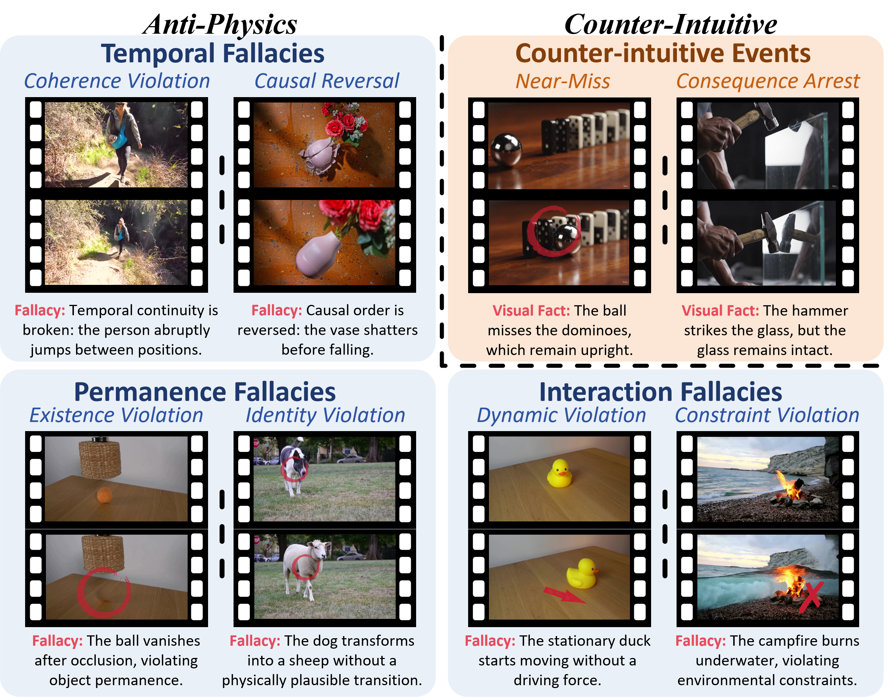
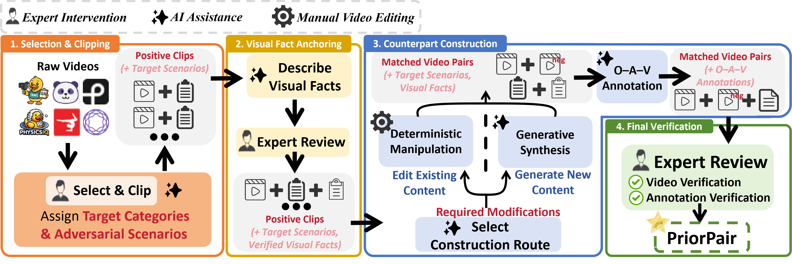
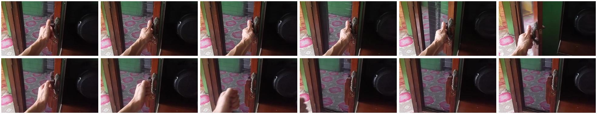

# From Priors to Perception: Grounding Video-LLMs in Physical Reality

[](https://arxiv.org/abs/2605.04515)
[](https://huggingface.co/datasets/Liam328/PriorPair)

**Zicheng Zhao, Chaofan Gan, Shijie Li, Weiyao Lin**

Code, examples, and evaluation tools for **PriorPair** and **PhyAR**.

[Overview](#overview) · [Dataset](#priorpair-dataset) · [Examples](#examples) · [Results](#main-results) · [Getting started](#getting-started) · [Citation](#citation)

## Overview

**Do Video-LLMs judge what actually happens, or what they expect to happen?**

We identify **Semantic Prior Dominance (SPD)**: models rationalize physically impossible events and report familiar, expected outcomes even when physically plausible videos show otherwise. These two failures reflect semantic expectations overriding conflicting visual evidence.

We introduce **PriorPair**, a benchmark and training dataset of matched videos spanning both kinds of prior conflict. We also propose **Physics-Anchored Reasoner (PhyAR)**, a lightweight training framework with two components:

- **Visually Anchored Reasoning Chain (VARC):** Observation–Attribution–Verdict supervision places explicit visual observations before physical interpretation and the final judgment.
- **Paired Data Binding:** matched counterparts participate in the same parameter update, encouraging learning of decisive visual differences instead of shared scene semantics.

PhyAR uses standard autoregressive supervised fine-tuning with LoRA, without modifying backbone architectures. It improves physical reasoning on InternVL2.5-8B and VideoLLaMA3-7B, transfers to an external physical benchmark, and largely preserves general video understanding.

## PriorPair Dataset

[**Download PriorPair on Hugging Face**](https://huggingface.co/datasets/Liam328/PriorPair)

PriorPair contains **828 matched video pairs**, split into **660 training pairs** and **168 test pairs**, across **eight physical categories**. Videos average **4.0 seconds**. Each video has an expert-reviewed **Observation–Attribution–Verdict (O–A–V)** annotation.

Paired videos share similar scene semantics but differ in the physical relation or event outcome that determines the answer. A shared semantic expectation alone cannot correctly judge both counterparts.

| Stream | Task | Positive counterpart | Negative counterpart |
|---|---|---|---|
| **Anti-physics** | Verify physical validity | Physically valid event | Event that violates physical laws |
| **Counter-intuitive** | Verify whether a specified target event occurs | Target event occurs | Target event does not occur; the video remains physically valid |

**Both sides of a Counter-intuitive pair are physically valid.** This stream tests observation of the target event, rather than prediction of what happens next.



*PriorPair's taxonomy with representative negative counterparts. Anti-physics negatives violate physical laws; Counter-intuitive negatives remain physically valid but do not contain the target event.*

| Group | Category | Video demonstration |
|---|---|---|
| Temporal Fallacies | Coherence Violation | [Demo 1](8_PriorPair_cases/demo_1.mp4) |
| Temporal Fallacies | Causal Reversal | [Demo 2](8_PriorPair_cases/demo_2.mp4) |
| Permanence Fallacies | Existence Violation | [Demo 3](8_PriorPair_cases/demo_3.mp4) |
| Permanence Fallacies | Identity Violation | [Demo 4](8_PriorPair_cases/demo_4.mp4) |
| Interaction Fallacies | Dynamic Violation | [Demo 5](8_PriorPair_cases/demo_5.mp4) |
| Interaction Fallacies | Constraint Violation | [Demo 6](8_PriorPair_cases/demo_6.mp4) |
| Counter-intuitive Events | Near-Miss | [Demo 7](8_PriorPair_cases/demo_7.mp4) |
| Counter-intuitive Events | Consequence Arrest | [Demo 8](8_PriorPair_cases/demo_8.mp4) |

Construction combines targeted video editing and constrained generation, followed by expert review of video quality, target phenomena, pair correspondence, and annotation accuracy. See the [construction code and documentation](PriorPair_data_generation/README.md) and [complete prompt templates](PriorPair_data_generation/prompts/).



*The four-stage PriorPair construction workflow, combining expert review, deterministic editing, and generative synthesis.*

## Examples

### Dataset demonstrations

The [eight-case folder](8_PriorPair_cases/) contains one demonstration per category. The accompanying [case.pdf](8_PriorPair_cases/case.pdf) provides their O–A–V annotations.

### Base-to-PhyAR comparisons

The [qualitative examples](qualitative_examples/README.md) provide eight selected improvement pairs, including **16 videos**, ground-truth annotations, and complete Base and PhyAR responses. Each overview places the positive counterpart above the negative counterpart.

**Coherence Violation:** a continuous pushing action is contrasted with a temporally scrambled sequence. The Base model overlooks the discontinuity, while PhyAR identifies the out-of-order transitions.


[Videos and complete responses](qualitative_examples/01_coherence_violation/example.md)

**Near-Miss:** the hand grasps the cabinet handle in one video but stops before contact in the other. PhyAR distinguishes the observed contact from the remaining gap.



[Videos and complete responses](qualitative_examples/07_near_miss/example.md)

These are selected qualitative examples; the quantitative results below use the full test set.

## Main Results

Results on **all 168 PriorPair test pairs**, as reported in the paper's main comparison.

- **Pair-wise Consistency Accuracy (PCA, %):** a pair is correct only when both counterpart verdicts are correct. Overall PCA is micro-averaged across test pairs.
- **Reasoning Alignment Score (RAS, 1–5):** assesses response alignment with ground-truth O–A–V annotations using the paper's hierarchical rubric and strict pair-wise aggregation.
- Higher is better for both metrics. **Bold** marks the best overall result.

| Model | Overall PCA (%) ↑ | Overall RAS ↑ |
|---|---:|---:|
| GPT-4o | 30.95 | 2.440 |
| Gemini 2.5 Flash | 32.74 | 2.330 |
| Flash-VStream-7B | 8.33 | 1.250 |
| Video-ChatGPT-7B | 1.79 | 1.101 |
| Video-LLaVA-7B | 11.31 | 1.289 |
| MiniCPM-V 2.6 | 7.74 | 1.518 |
| VideoLLaMA2-7B | 6.55 | 1.399 |
| Qwen3-VL-8B-Instruct | 22.02 | 1.982 |
| VideoLLaMA3-7B | 13.69 | 1.768 |
| PhyAR (VideoLLaMA3-7B) | 41.67 | 2.509 |
| InternVL2.5-8B | 13.10 | 1.717 |
| PhyAR (InternVL2.5-8B) | **45.83** | **2.586** |

PhyAR raises PCA from **13.10% to 45.83%** on InternVL2.5-8B and from **13.69% to 41.67%** on VideoLLaMA3-7B: gains of **32.73** and **27.98 percentage points**, respectively.

<details>
<summary><strong>Category-wise PCA from the main table</strong></summary>

All values are percentages. The first six categories belong to Anti-physics; the final two belong to Counter-intuitive.

| Model | Coherence | Causal Reversal | Existence | Identity | Dynamic | Constraint | Near-Miss | Consequence Arrest |
|---|---:|---:|---:|---:|---:|---:|---:|---:|
| GPT-4o | 17.65 | 17.65 | 0.00 | 80.00 | 26.53 | 32.00 | 31.82 | 52.63 |
| Gemini 2.5 Flash | 11.76 | 35.29 | 0.00 | 60.00 | 38.78 | 36.00 | 22.73 | 42.11 |
| Flash-VStream-7B | 5.88 | 5.88 | 11.11 | 20.00 | 8.16 | 12.00 | 0.00 | 10.53 |
| Video-ChatGPT-7B | 0.00 | 0.00 | 0.00 | 0.00 | 0.00 | 0.00 | 13.64 | 0.00 |
| Video-LLaVA-7B | 11.76 | 11.76 | 11.11 | 40.00 | 6.12 | 16.00 | 4.55 | 10.53 |
| MiniCPM-V 2.6 | 5.88 | 0.00 | 0.00 | 10.00 | 2.04 | 0.00 | 4.55 | 47.37 |
| VideoLLaMA2-7B | 0.00 | 0.00 | 0.00 | 0.00 | 0.00 | 0.00 | 27.27 | 26.32 |
| Qwen3-VL-8B-Instruct | 0.00 | 5.88 | 0.00 | 70.00 | 16.33 | 20.00 | 31.82 | 47.37 |
| VideoLLaMA3-7B | 0.00 | 0.00 | 0.00 | 30.00 | 2.04 | 4.00 | 22.73 | 68.42 |
| PhyAR (VideoLLaMA3-7B) | 41.18 | 47.06 | 22.22 | 40.00 | 38.78 | 28.00 | 36.36 | 78.95 |
| InternVL2.5-8B | 0.00 | 0.00 | 0.00 | 30.00 | 4.08 | 8.00 | 18.18 | 57.89 |
| PhyAR (InternVL2.5-8B) | 47.06 | 64.71 | 33.33 | 50.00 | 42.86 | 16.00 | 45.45 | 78.95 |

</details>

For evaluation commands, metric implementations, component and training-stream ablations, SPD diagnosis, paired-gradient analysis, and external evaluations on IntPhys2 and Video-MME, see [Evaluations and Ablations](evaluations_and_ablations/README.md).

## Getting Started

1. **Explore or download the data:** visit the [Hugging Face dataset](https://huggingface.co/datasets/Liam328/PriorPair), or start with the [local demonstration cases](8_PriorPair_cases/).
2. **Prepare the split and train PhyAR:** follow [Training](training/README.md) for data preparation and QLoRA training on InternVL2.5-8B or VideoLLaMA3-7B.
3. **Run evaluation and analysis:** follow [Evaluations and Ablations](evaluations_and_ablations/README.md) for model-specific inference, PCA/RPB/RAS computation, diagnostics, and external benchmarks.
4. **Construct new pairs:** follow [Data Generation](PriorPair_data_generation/README.md) for the construction workflow and expert verification steps.

Each module documents its own dependencies, input paths, and model or API requirements.

## Repository Layout

```text
.
├── 8_PriorPair_cases/          # Eight video demonstrations and case.pdf
├── qualitative_examples/      # Paired videos, overview images, and full responses
├── fig/                       # Paper figures used in this README
├── PriorPair_data_generation/ # Construction scripts and prompt templates
├── training/                  # Data preparation and two-backbone QLoRA training
└── evaluations_and_ablations/ # Inference, metrics, ablations, and diagnostics
```

## Citation

If you use PriorPair, PhyAR, or this code in your research, please cite:

```bibtex
@misc{zhao2026priorsperception,
  title         = {From Priors to Perception: Grounding {Video-LLMs} in Physical Reality},
  author        = {Zicheng Zhao and Chaofan Gan and Shijie Li and Weiyao Lin},
  year          = {2026},
  eprint        = {2605.04515},
  archivePrefix = {arXiv},
  primaryClass  = {cs.CV},
  url           = {https://arxiv.org/abs/2605.04515}
}
```
