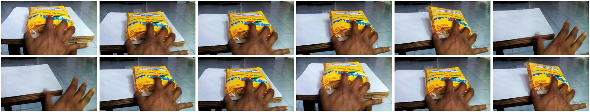

# Coherence Violation

## Selection metadata

- Category: `I_A_Coherence_Violation`
- Sample indices: positive `2`, negative `3`
- Positive video: `videos/positive.mp4`
- Negative video: `videos/negative.mp4`
- Baseline: PCA = 0, sample accuracy = 1/0, reasoning scores = 3/1, pair RAS = 1.0
- PhyAR: PCA = 1, sample accuracy = 1/1, reasoning scores = 5/5, pair RAS = 5.0
- Selection note: Close-up action with an easily visible scrambled temporal order. PhyAR receives 5/5 reasoning scores.

The overview places the six positive-counterpart frames first and the six negative-counterpart frames second.

## Positive counterpart

### Ground Truth

**Observation**: A hand pushes a yellow packet across a white table surface, sliding it towards the edge until it tips over and falls out of the frame.

**Attribution**: This sequence of events perfectly adheres to the linearity of time and the micro-temporal continuity of physical actions, demonstrating a smooth, continuous progression of applied force followed by gravity.

**Verdict**: The video is physically valid.

### Baseline output

Observation: The video shows a hand holding a yellow package on a white surface. The hand moves the package slightly, and then the package is removed from the surface, leaving the white surface empty.

Attribution: The observed events comply with real-world physical constraints. The hand's movement and the removal of the package are consistent with normal physical interactions. There are no violations of temporal, causal, thermodynamic, or spatial constraints in the video.

Verdict: The video is physically valid.

### PhyAR output

**Observation**: A hand pushes a yellow packaged loaf of bread resting on white paper atop a wooden table. The hand continues to apply force, pushing the package across the surface until it eventually falls off the edge of the table, landing out of the frame.

**Attribution**: This sequence of events perfectly adheres to macroscopic causality, where the physical cause (the hand applying force to the package) logically and chronologically precedes the effect (the package sliding and falling off the table).

**Verdict**: The video is physically valid.

## Negative counterpart

### Ground Truth

**Observation**: A yellow packet is seen tipping over the edge of a white table, then the scene suddenly jumps backward to a hand just beginning to push the packet across the center of the table. Next, the packet abruptly appears already falling out of the frame, before cutting back to the hand sliding the packet midway towards the table's edge.

**Attribution**: This disjointed jumping of states violates the fundamental linearity of time and the macro-causality of motion. The chronological order of the frames is scrambled, resulting in the objects abruptly teleporting between different stages of a single continuous action without fluid transition, explicitly constituting a Coherence Violation.

**Verdict**: The video is physically invalid.

### Baseline output

Observation: The video shows a hand repeatedly pressing down on a yellow package placed on a white surface. The hand's motion is consistent, and the package remains stationary throughout the sequence.

Attribution: The observed events comply with real-world physical constraints. The hand's motion is consistent with the action of pressing down, and the package remains stationary, indicating no external forces are acting upon it. There are no temporal, causal, thermodynamic, or spatial constraints that are violated in the video.

Verdict: The video is physically valid.

### PhyAR output

**Observation**: A hand is seen pushing a yellow packaged loaf of bread across a white sheet of paper on a wooden table, causing the bread to slide and rotate. Suddenly, the scene jumps to the hand just entering the frame to grab the intact loaf of bread, and then abruptly cuts back to the hand pushing the already sliding, rotating loaf.

**Attribution**: The disjointed jumping of states violates the fundamental linearity of time and the macro-causality of motion. The chronological order of the frames is scrambled, resulting in the hand and the bread abruptly teleporting between the middle of a sliding action and the beginning of a grabbing action without fluid transition, which is a clear Coherence Violation.

**Verdict**: The video is physically invalid.
