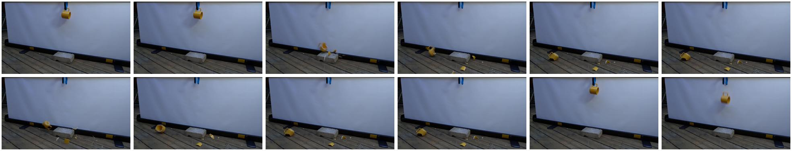

# Causal Reversal

## Selection metadata

- Category: `I_B_Causal_Reversal`
- Sample indices: positive `34`, negative `35`
- Positive video: `videos/positive.mp4`
- Negative video: `videos/negative.mp4`
- Baseline: PCA = 0, sample accuracy = 1/0, reasoning scores = 4/1, pair RAS = 1.0
- PhyAR: PCA = 1, sample accuracy = 1/1, reasoning scores = 5/5, pair RAS = 5.0
- Selection note: High-resolution mug-breaking sequence with a clear effect-before-cause reversal. PhyAR receives 5/5 reasoning scores.

The overview places the six positive-counterpart frames first and the six negative-counterpart frames second.

## Positive counterpart

### Ground Truth

**Observation**: A yellow mug hangs from a blue hook above a grey concrete brick resting on a wooden deck in front of a white screen. The mug detaches from the hook, falls downward, and strikes the brick. Upon contact, the mug shatters into multiple pieces that scatter and eventually come to rest on the wooden deck around the brick.

**Attribution**: The sequence perfectly adheres to macroscopic causality: the mug's release and fall physically and chronologically precede its collision with the concrete brick, which in turn precedes the ceramic mug shattering and its fragments scattering.

**Verdict**: The video is physically valid.

### Baseline output

Observation: The video shows a yellow cup hanging from a blue string above a whiteboard. A brick is placed on the ground beneath the cup. The cup is released and falls onto the brick, shattering into pieces. The pieces scatter across the wooden floor.

Attribution: The observed events comply with the physical constraints of gravity and the impact of a falling object. The cup's descent and subsequent shattering upon impact with the brick are consistent with real-world physics. The spatial arrangement of the cup, brick, and whiteboard does not violate any physical constraints.

Verdict: The video is physically valid.

### PhyAR output

**Observation**: A yellow mug is suspended in mid-air, falls vertically, and strikes a concrete block resting on a wooden deck. Upon impact, the mug shatters into multiple pieces, which then scatter across the deck and settle on the ground.

**Attribution**: This sequence of events perfectly adheres to macroscopic causality, where the physical cause (the mug falling and striking the concrete block) logically and chronologically precedes the effect (the mug shattering and scattering into pieces).

**Verdict**: The video is physically valid.

## Negative counterpart

### Ground Truth

**Observation**: The sequence begins with pieces of a shattered yellow mug scattering and settling around a grey concrete brick on a wooden deck. Abruptly, the scene cuts to an intact yellow mug hanging from a blue hook above the brick. The intact mug then detaches and falls toward the concrete surface.

**Attribution**: The macroscopic effect, the mug already being shattered with fragments scattering, is presented before its physical cause, the intact mug being released and falling onto the concrete brick. This reverses the fundamental arrow of time and macroscopic causality, explicitly constituting a Causal Reversal.

**Verdict**: The video is physically invalid.

### Baseline output

### Observation
The video shows a sequence where a yellow cup is suspended by a string and is released. The cup falls and lands on a concrete block, shattering into pieces. The pieces scatter on the wooden deck.

### Attribution
- **Temporal Constraints**: The sequence of events follows a logical temporal order, starting with the cup being suspended, then released, and finally falling and shattering.
- **Causal Constraints**: The cause-and-effect relationship is clear: the release of the cup leads to its fall and subsequent shattering.
- **Thermodynamic Constraints**: The energy transformation from potential to kinetic energy and then to thermal energy upon impact is consistent with real-world physics.
- **Spatial Constraints**: The spatial arrangement of the objects (cup, string, concrete block, and deck) is consistent with the observed events.

### Verdict
The video is physically valid.

### PhyAR output

**Observation**: A yellow mug is seen shattering into multiple pieces and scattering across a wooden deck in front of a whiteboard. Abruptly, the scene cuts to a yellow mug intact, suspended by a blue carabiner, descending rapidly, and striking a concrete block resting on the deck.

**Attribution**: Presenting the macroscopic effect (the mug shattering) before its physical cause (the intact mug descending and striking the block) violates the fundamental arrow of time and macroscopic causality, explicitly identifying it as a Causal Reversal.

**Verdict**: The video is physically invalid.
