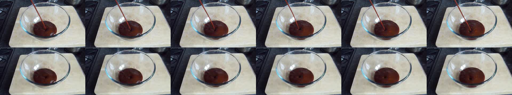

# Existence Violation

## Selection metadata

- Category: `II_A_Existence_Violation`
- Sample indices: positive `74`, negative `75`
- Positive video: `videos/positive.mp4`
- Negative video: `videos/negative.mp4`
- Baseline: PCA = 0, sample accuracy = 1/0, reasoning scores = 3/2, pair RAS = 2.0
- PhyAR: PCA = 1, sample accuracy = 1/1, reasoning scores = 4/4, pair RAS = 4.0
- Selection note: The positive counterpart contains a visible liquid input, whereas the liquid in the negative counterpart rises and swirls without any visible input. PhyAR identifies the spontaneous rise and correctly classifies both counterparts.

The overview places the six positive-counterpart frames first and the six negative-counterpart frames second.

## Positive counterpart

### Ground Truth

**Observation**: A clear glass bowl rests on a wooden chopping board. A thick, dark reddish-brown sauce is continuously poured from an off-screen source above into the bowl. As the stream hits the center, the liquid inside the bowl swirls, ripples, and gradually rises in volume.

**Attribution**: This sequence adheres perfectly to the Conservation of Matter and the physical laws of fluid dynamics. The continuous, visible stream of sauce provides a tangible physical source of matter, which logically explains the liquid rippling upon impact and the steady increase of the liquid's volume inside the bowl.

**Verdict**: The video is physically valid.

### Baseline output

Observation: The video shows a glass bowl containing a thick, brown liquid, likely a sauce or mixture, placed on a wooden cutting board. A red spatula is being used to stir the contents of the bowl. The bowl is situated on a kitchen countertop, and there is a stove visible in the background.

Attribution: The observed events comply with real-world physical constraints. The stirring action is a common method for mixing ingredients, and the presence of a sauce or mixture in a bowl is typical in a kitchen setting. The use of a spatula to stir is a valid method for mixing liquids, and the placement of the bowl on a cutting board is a standard practice for food preparation.

Verdict: The video is physically valid.

### PhyAR output

**Observation**: A dark brown liquid is continuously poured from a red spout into a clear glass bowl resting on a light-colored cutting board. The liquid accumulates in the bowl, forming a growing pool that ripples and spreads outward, while the spout remains steady in its position.

**Attribution**: This sequence of events perfectly adheres to the linearity of time and micro-temporal continuity of physical actions. The continuous pouring of the liquid, the accumulation of the pool, and the resulting ripples are all chronological and irreversible, following the natural progression of a fluid being dispensed.

**Verdict**: The video is physically valid.

## Negative counterpart

### Ground Truth

**Observation**: A clear glass bowl rests on a wooden chopping board. The dark reddish-brown liquid inside the bowl is seen continuously swirling, rippling, and gradually rising in volume on its own, with no visible stream, physical input, or source pouring into the bowl from above.

**Attribution**: This event strictly violates the Conservation of Matter, specifically representing an Existence Violation in the form of Spontaneous Appearance (Uncovered). Matter cannot be created from nothing; therefore, it is a physical fallacy for a liquid to spontaneously appear, cause ripples, and steadily increase its volume in a bowl without any visible physical source or input stream.

**Verdict**: The video is physically invalid.

### Baseline output

Observation: The video shows a glass bowl containing a brown, viscous substance, likely a sauce or batter, placed on a wooden cutting board. The bowl is situated on a kitchen countertop, and the background includes a stove and other kitchen items.

Attribution: The observed events comply with real-world physical constraints. The bowl is placed on a stable surface, and the substance inside appears to be a typical kitchen ingredient. There are no indications of unusual or physically anomalous activities.

Verdict: The video is physically valid.

### PhyAR output

**Observation**: A glass bowl containing a dark brown liquid sits on a light-colored cutting board. The liquid inside the bowl spontaneously rises and swirls in a continuous, circular motion, forming a vortex. The liquid level visibly increases, and the swirling motion intensifies, creating a whirlpool effect.

**Attribution**: This phenomenon violates the Causal Consistency of Physical Interactions, specifically demonstrating a severe Dynamic Violation. According to the laws of fluid dynamics, a liquid cannot spontaneously rise and swirl in a continuous, circular motion without an external mechanical force or energy source. The continuous increase in the liquid level and the intensifying swirling motion are physically impossible, as they defy gravity and the inherent inertia of the liquid.

**Verdict**: The video is physically invalid.
