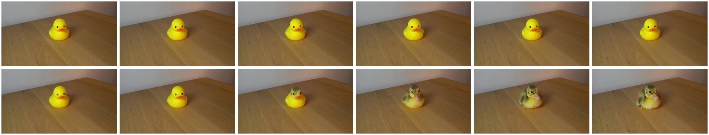

# Identity Violation

## Selection metadata

- Category: `II_B_Identity_Violation`
- Sample indices: positive `98`, negative `99`
- Positive video: `videos/positive.mp4`
- Negative video: `videos/negative.mp4`
- Baseline: PCA = 0, sample accuracy = 1/0, reasoning scores = 5/1, pair RAS = 1.0
- PhyAR: PCA = 1, sample accuracy = 1/1, reasoning scores = 5/5, pair RAS = 5.0
- Selection note: High-resolution transformation from a rubber duck into a live duckling. PhyAR receives 5/5 reasoning scores.

The overview places the six positive-counterpart frames first and the six negative-counterpart frames second.

## Positive counterpart

### Ground Truth

**Observation**: A single yellow rubber duck with an orange beak and black eyes sits completely motionless on a light brown wooden table. The object remains static throughout the entire sequence, and the lighting creates a consistent shadow to the right of the duck.

**Attribution**: This phenomenon perfectly adheres to the physical principle of Conservation of Identity and Intrinsic Properties, as well as inertia. An inanimate synthetic object maintains its fundamental characteristics, material composition, structural form, and static state of rest when not subjected to any external forces or transformative physical processes.

**Verdict**: The video is physically valid.

### Baseline output

Observation: The video shows a single yellow rubber duck placed on a wooden surface. The duck remains stationary throughout the video, with no changes in its position or the environment.

Attribution: The observed events comply with real-world physical constraints. The rubber duck is a solid object, and its placement on the wooden surface does not violate any physical laws. There is no indication of any temporal, causal, thermodynamic, or spatial constraints being violated.

Verdict: The video is physically valid.

### PhyAR output

**Observation**: A yellow rubber duck with a red beak and black eyes sits stationary on a light wooden table against a white wall. The duck remains perfectly still and motionless throughout the entire duration of the video.

**Attribution**: This scene perfectly adheres to the core principle of Conservation of Identity and Intrinsic Properties. An inanimate, rigid object like a rubber duck naturally maintains its fundamental characteristics, form, and state of rest unless subjected to a continuous external force. The duck's static state aligns with the laws of classical mechanics and the irreversible thermodynamic arrow of time.

**Verdict**: The video is physically valid.

## Negative counterpart

### Ground Truth

**Observation**: A single yellow rubber duck sits on a light brown wooden table with a consistent shadow cast to its right. While remaining in the same position, the synthetic rubber duck seamlessly morphs into a real, live duckling. The smooth rubber texture spontaneously transitions into fluffy yellow feathers and organic biological features without any external interaction or obscuring mechanism.

**Attribution**: This event violates the physical principle of Conservation of Identity and Intrinsic Properties, specifically demonstrating an Identity Violation through Spontaneous Transformation (Morphology/Species Mutation). An inanimate synthetic object cannot undergo a sudden, physically impossible mutation into completely different living organic tissue and change its fundamental species state without external intervention or a realistic physical mechanism.

**Verdict**: The video is physically invalid.

### Baseline output

Observation: The video shows a yellow rubber duck on a wooden table. Initially, the duck is stationary. Then, the duck's beak opens, and it appears to be quacking. The duck's beak closes, and it returns to a stationary position.

Attribution: The observed events comply with real-world physical constraints. The duck's beak opening and closing is a realistic action for a rubber duck, and the duck remains on the table throughout the video, which is consistent with spatial constraints.

Verdict: The video is physically valid.

### PhyAR output

**Observation**: A yellow rubber duck sits stationary on a wooden table. Suddenly, the duck morphs into a small, live yellow duckling with a pink beak and downy feathers. The duckling then begins to move, waddling and flapping its tiny wings on the table surface.

**Attribution**: This event violates the principle of Conservation of Identity and Intrinsic Properties, specifically demonstrating an Identity Violation through Spontaneous Transformation (Morphology/Species Mutation). An inanimate rubber object cannot suddenly transform into a living biological organism without any realistic, transformative physical process.

**Verdict**: The video is physically invalid.
