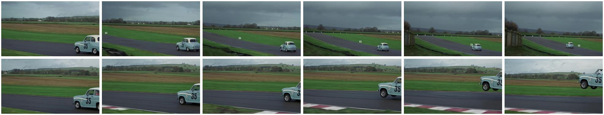

# Dynamic Violation

## Selection metadata

- Category: `III_A_Dynamic_Violation`
- Sample indices: positive `122`, negative `123`
- Positive video: `videos/positive.mp4`
- Negative video: `videos/negative.mp4`
- Baseline: PCA = 0, sample accuracy = 1/0, reasoning scores = 5/2, pair RAS = 2.0
- PhyAR: PCA = 1, sample accuracy = 1/1, reasoning scores = 5/4, pair RAS = 4.5
- Selection note: The car visibly lifts from the track without a supporting mechanism. PhyAR identifies the unsupported airborne motion and correctly classifies both counterparts.

The overview places the six positive-counterpart frames first and the six negative-counterpart frames second.

## Positive counterpart

### Ground Truth

**Observation**: A light blue vintage racing car, marked with the number 35, is driving away from the camera on a dark asphalt race track. The car enters from the right and travels towards the left background, following the curvature of the track. The environment consists of a flat green grassy field with hedgerows and distant hills under a grey, overcast sky.

**Attribution**: The phenomenon adheres strictly to classical mechanics and causal consistency. The car's motion aligns with the expected physics of a moving vehicle; it utilizes the friction between the tires and the asphalt to navigate the curve safely, while Earth's gravity maintains its mechanical equilibrium firmly on the solid ground.

**Verdict**: The video is physically valid.

### Baseline output

Observation: A vintage car with the number 35 on its side is driving on a racetrack. The car is moving from right to left across the frame. The sky is overcast, and the landscape consists of green fields and a wooden fence. The car is the only moving object in the scene.

Attribution: The car's movement is consistent with the laws of physics, as it is traveling along a curved path on the racetrack. The car's speed appears to be moderate, and there are no visible signs of unusual or physically anomalous activity.

Verdict: The video is physically valid.

### PhyAR output

**Observation**: A light blue vintage car with the number '35' on its side drives from the right side of the frame to the left along a paved race track. The vehicle moves continuously through a curve, passing behind a wooden fence on the left side of the track. The background consists of green grass, brown plowed fields, and a cloudy sky.

**Attribution**: The sequence of events perfectly adheres to the linearity of time and the micro-temporal continuity of physical actions. The car's continuous forward motion along the track unfolds in a smooth, chronological progression without any interruptions.

**Verdict**: The video is physically valid.

## Negative counterpart

### Ground Truth

**Observation**: A light blue vintage racing car, marked with the number 35, is driving away from the camera on a dark asphalt race track. While continuing along the road, the car suddenly lifts off from the asphalt without any ramp, collision, explosion, cable, jet thrust, or visible external mechanism. Its tires separate from the road and the car rises upward into the sky with no visible object touching or lifting it.

**Attribution**: This event is a Dynamic Violation, specifically Phantom Force (Causality without Contact). According to classical mechanics, a heavy car cannot suddenly leave the road and rise upward without an external lifting force or physical mechanism. The car's spontaneous ascent into the sky despite the absence of any visible contact, support, or propulsion is physically impossible.

**Verdict**: The video is physically invalid.

### Baseline output

Observation: A vintage car with the number 35 is seen driving on a race track. The car is moving at a high speed, and its wheels are off the ground as it takes a jump. The background shows a rural landscape with green fields and hills under a cloudy sky.

Attribution: The car's motion and the fact that it is airborne suggest that it is performing a jump or stunt. The car's design and the number 35 indicate that it may be a classic or vintage vehicle participating in a racing event. The rural setting and the absence of other vehicles or people suggest that this is a controlled environment, possibly a closed circuit or a private track.

Verdict: The video is physically valid.

### PhyAR output

**Observation**: A light blue vintage racing car with the number 35 on its side is seen driving rapidly from right to left on a paved race track. As the vehicle travels, its front wheels lift off the ground, and the car continues to float horizontally in the air while maintaining a consistent speed and trajectory.

**Attribution**: This phenomenon violates the principle of Causal Consistency of Physical Interactions, specifically presenting a Dynamic Violation (Inertia and Friction). A vehicle's wheels are designed to roll on a solid surface, and the friction between the tires and the track is essential for maintaining traction and providing the necessary grip for acceleration and turning. The car's front wheels lifting off the ground and continuing to float horizontally in the air without any visible external force or structural support completely defies gravity and friction, which is physically impossible.

**Verdict**: The video is physically invalid.
