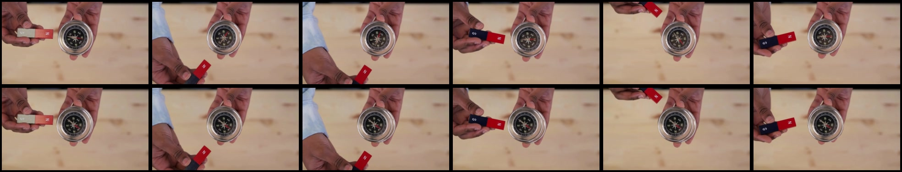

# Constraint Violation

## Selection metadata

- Category: `III_B_Constraint_Violation`
- Sample indices: positive `220`, negative `221`
- Positive video: `videos/positive.mp4`
- Negative video: `videos/negative.mp4`
- Baseline: PCA = 0, sample accuracy = 1/0, reasoning scores = 4/1, pair RAS = 1.0
- PhyAR: PCA = 1, sample accuracy = 1/1, reasoning scores = 5/5, pair RAS = 5.0
- Selection note: The magnet is moved close to the compass, but only the positive counterpart shows the expected needle rotation. PhyAR identifies the missing magnetic response and correctly classifies both counterparts.

The overview places the six positive-counterpart frames first and the six negative-counterpart frames second.

## Positive counterpart

### Ground Truth

**Observation**: A pair of hands is shown against a blurred light wooden background. The right hand holds a circular silver compass, while the left hand holds a rectangular bar magnet with red and blue poles. As the left hand moves the magnet around the compass, the red-tipped end of the compass needle rotates vigorously to align with the changing position of the magnet.

**Attribution**: This phenomenon perfectly adheres to the laws of electromagnetism and the causal consistency of physical interactions. The compass needle is a small magnet that naturally aligns itself with the local magnetic field. The movement of the nearby strong bar magnet alters this field, providing a direct physical cause that proportionately results in the vigorous rotation of the compass needle to maintain alignment.

**Verdict**: The video is physically valid.

### Baseline output

Observation: A person is holding a compass in one hand and a magnet in the other. The magnet is moved around the compass, causing the needle to spin and point in different directions. The compass needle eventually settles into a stable position pointing towards the North.

Attribution: The movement of the magnet affects the compass needle due to magnetic forces. The compass needle's spinning motion is a result of the interaction between the magnet and the compass's magnetic field. The compass needle's eventual stabilization is due to the damping effect of friction within the compass mechanism.

Verdict: The video is physically valid.

### PhyAR output

**Observation**: A person's hands hold a small rectangular red and blue bar magnet labeled 'S' and 'N' on the left, and a silver compass on the right. The magnet is moved closer to the compass, causing the red needle to rotate and align with the magnetic field. The magnet is then moved away, and the needle returns to its original position.

**Attribution**: This phenomenon perfectly adheres to the principles of magnetism and the causal consistency of physical interactions. The magnetic field generated by the bar magnet interacts with the compass needle, causing it to rotate and align with the magnetic field. When the magnet is removed, the external magnetic influence is removed, and the needle naturally returns to its equilibrium state.

**Verdict**: The video is physically valid.

## Negative counterpart

### Ground Truth

**Observation**: A pair of hands is shown against a blurred light wooden background. The right hand holds a circular silver compass, while the left hand holds a rectangular bar magnet with red and blue poles. The left hand vigorously waves the strong bar magnet extremely close to the compass face, but the compass needle remains perfectly stationary and rigid relative to the compass housing, exhibiting absolutely no reaction or rotation.

**Attribution**: This scenario violates the principle of Causal Consistency of Physical Interactions, specifically demonstrating a Causal Disproportion fallacy. A compass needle is highly sensitive to external magnetic fields. Vigorously waving a strong bar magnet in extreme proximity to the compass would inevitably exert a substantial magnetic force on the needle. The fact that the needle remains perfectly stationary and completely unreactive fundamentally mismatches the intense nature and magnitude of the causal trigger.

**Verdict**: The video is physically invalid.

### Baseline output

Observation: A person is holding a compass in one hand and a bar magnet in the other. The person moves the magnet around the compass, showing how the needle reacts to the magnet's presence.

Attribution: The movement of the magnet near the compass demonstrates the principles of magnetism and the Earth's magnetic field. The compass needle's reaction to the magnet's proximity is a direct result of the interaction between the two objects, following the laws of physics governing magnetic fields and their effects on magnetic materials.

Verdict: The video is physically valid.

### PhyAR output

**Observation**: A person's hands hold a small bar magnet with a red 'N' pole on the left and a silver compass on the right. The hands move the magnet closer to the compass, but the compass needle remains completely static and does not react to the magnet's proximity.

**Attribution**: This phenomenon violates the principle of Causal Consistency of Physical Interactions, specifically presenting a Causal Disproportion & Conservation Violation. According to the laws of magnetism, the magnetic field generated by the red 'N' pole should exert a physical torque on the compass needle, causing it to rotate and align with the magnetic field. The compass needle remaining completely static despite the magnet's proximity contradicts the inherent physical properties of magnetic forces.

**Verdict**: The video is physically invalid.
