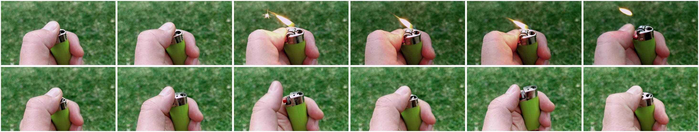

# Consequence Arrest

## Selection metadata

- Category: `IV_B_Consequence_Arrest`
- Sample indices: positive `320`, negative `321`
- Positive video: `videos/positive.mp4`
- Negative video: `videos/negative.mp4`
- Baseline: PCA = 0, sample accuracy = 1/0, reasoning scores = 4/2, pair RAS = 2.0
- PhyAR: PCA = 1, sample accuracy = 1/1, reasoning scores = 4/5, pair RAS = 4.5
- Selection note: Clear close-up contrast between successful ignition and repeated lighter operation without a flame. Baseline hallucinates a flame in the negative counterpart, whereas PhyAR identifies its absence.

The overview places the six positive-counterpart frames first and the six negative-counterpart frames second.

## Positive counterpart

### Ground Truth

**Observation**: A close-up shows a hand holding a lime-green disposable lighter against a blurred grass background. The thumb flicks the spark wheel, visible sparks appear, and a yellow flame ignites. The flame burns while the thumb holds the red lever and goes out when the lever is released.

**Attribution**: The spark wheel generates ignition sparks while the depressed lever releases a combustible fuel-air mixture. Meeting both conditions allows combustion to begin and sustain the visible flame.

**Verdict**: The target event occurred.

### Baseline output

Observation: The video shows a hand holding a green lighter. Initially, the lighter is closed. As the video progresses, the lighter is opened, and a flame is produced. The flame is visible, indicating that the lighter is functioning.

Attribution: The visual evidence supports that the target event occurred. The sequence of the lighter being opened and a flame being produced clearly indicates that the lighter is functioning as intended.

Verdict: The target event occurred.

### PhyAR output

**Observation**: A hand holds a green lighter and moves the flint across the spark wheel. A bright spark and a small flame appear, and the lighter remains lit.

**Attribution**: The hand moves the flint across the spark wheel with enough speed and force to create a spark that ignites the fuel inside the lighter.

**Verdict**: The target event occurred.

## Negative counterpart

### Ground Truth

**Observation**: A thumb repeatedly rolls the spark wheel and presses the red lever of a lime-green lighter-shaped device. The bare metal top produces no visible spark or flame and remains dark and inert throughout.

**Attribution**: The completed lighter action does not reach the ignition threshold, so no spark is produced and no flame ignites.

**Verdict**: The target event did not occur.

### Baseline output

Observation: The video shows a close-up of a hand holding a green lighter with a metallic top. The lighter is being operated, and the flame is visible at the top of the lighter. The flame is steady and appears to be burning.

Attribution: The visual evidence clearly shows the lighter producing a flame. The flame is visible and appears to be burning steadily, indicating that the lighter is functioning as intended.

Verdict: The target event occurred.

### PhyAR output

**Observation**: A hand holds a green lighter outdoors. The thumb presses the red ignition button, and the spark wheel rotates. The lighter's metallic ignition area remains dark, and no flame appears.

**Attribution**: The lighter's ignition area does not reach its ignition temperature, so no flame is produced.

**Verdict**: The target event did not occur.
